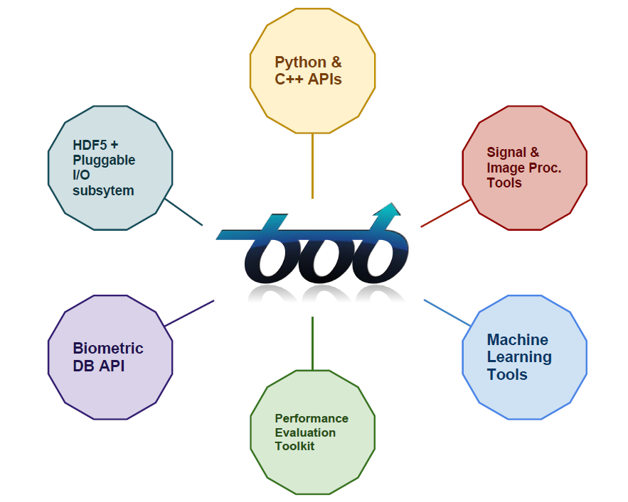

.. vim: set fileencoding=utf-8 :
.. Laurent El Shafey <Laurent.El-Shafey@idiap.ch>
.. Wed Mar 14 12:31:35 2012 +0100
.. 
.. Copyright (C) 2011-2012 Idiap Research Institute, Martigny, Switzerland
.. 
.. This program is free software: you can redistribute it and/or modify
.. it under the terms of the GNU General Public License as published by
.. the Free Software Foundation, version 3 of the License.
.. 
.. This program is distributed in the hope that it will be useful,
.. but WITHOUT ANY WARRANTY; without even the implied warranty of
.. MERCHANTABILITY or FITNESS FOR A PARTICULAR PURPOSE.  See the
.. GNU General Public License for more details.
.. 
.. You should have received a copy of the GNU General Public License
.. along with this program.  If not, see <http://www.gnu.org/licenses/>.

**************
 Introduction
**************

|project| is a signal-processing and machine learning toolbox for Biometrics
developed at the `Idiap`_ Research Institute, in Switzerland. 

*************
 Motivations
*************

We designed and released |project| for the following main reasons:

* Need of a software platform where stable algorithms and common tools used for research purposes can be put at.

* Thoroughly tested at every minor change: correctness above speed

* Easy way to reproduce published results

* Environment that allows fast pace development, with throw-away prototypes

* Ability to implement fast versions (in `C++`_) of identified bottlenecks

* Re-use existing open-source packages and standards

* Open source (`GPL-3.0`_) with hopes it is useful to others. (For more information on licensing, please visit our :doc:`BobLicensing`)

**********
 Features
**********

|project| currently supports **Linux** and **Mac OS X** operating systems and provides the following features:

Python and C++ APIs
===================

The toolbox is written in a mix of `Python`_ and `C++`_ and is designed to 
be both efficient and to reduce development time. `C++`_ has been chosen to 
write fast code for the key features of the library. On top of it, `Python`_ 
bindings are provided which allow to call the efficient C++ compiled code 
from an interactive interpreter. This means that `Python`_ can be seen as 
a default lab-like environment when using |project|, and that any other 
existing `Python`_ tool could be easily glued to it.

Data representation
===================

The fundamental data structure of the library consists in multi-dimensional
arrays. In signal-processing and machine learning, arrays are indeed a suitable
representation for many different types of digital signals such as images, 
audio data, extracted features, etc. At the C++ level, this support is
achieved with `Blitz++`_, whereas at the python level, `Numpy`_ arrays are
used.

Mathematical and signal processing
==================================

Machine learning algorithms and signal processing usually rely on a 
sequence of low level mathematical operations. For efficiency purpose,
eigenvalue decomposition, matrix inversion and other basic linear algebra 
are performed using `LAPACK`_ routines at the `C++`_ level. In addition,
Fast Fourier Transform is made possible via a bridge to the `FFTW`_ library.

Image processing
================

|project| has been developed by researchers tackling many machine vision
problems. Furthermore, numerous image processing tools are provided such as
filtering (Gaussian, Median, Gabor), visual feature extraction 
(LBP, SIFT bridge to `VLFeat`_), face normalization and optical flow.

Machine learning
================

Several machine learning algorithms have been integrated into the library.
Dimensionality reduction is supported using Principal Component Analysis,
Linear Discriminant Analysis and its probabilistic variant. k-Means is 
provided for data clustering, and classification is possible using both 
generative modeling techniques (Gaussian Mixture Models, Join Factor Analysis) 
and discriminative approaches such as Multi-Layer Perceptrons or Support Vector 
Machine (via a `LIBSVM`_ bridge). Wrt. to machine learning, |project| relies
on the two following concepts: **machine** and **trainer**. A **machine** is 
fed with an input **x** and generates an output **y**. For instance, a 
**LinearMachine** projects the input data **x** into the output **y**, using an
internal projection matrix **W**. Such a machine could be trained with the concept
of **trainer**. For instance, the **LinearMachine** could be trained using
Principal Component Analysis or Linear Discriminant Analysis.

Storing and managing data
=========================

The library has been designed to run on various platforms and to be easily 
interfaced with any other software. Furthermore, we have chosen the open and 
portable `HDF5`_ library and file format as our core feature for storing 
and managing data. `HDF5`_ is very flexible and hence allows us to store simple 
multi-dimensional arrays as well as complex machine learning models. Many 
tools for viewing, and analyzing the data are already available.
In addition, we also support the loading and storing of most image formats
thanks to `ImageMagick`_, videos through `FFmpeg`_ as well as 
standard `Matlab`_ file using `MatIO`_.

Database support
================

The library currently provides an API to easily query and interface with 
well know biometric database. In particular, several protocols are integrated 
with the aim at improving reproducibility of scientific publications.

Performance Evaluation
======================

A module of the library is dedicated to performance evaluation. Computation
of false alarm and false rejection rate, equal error rate are supported as 
well as the generation of ROC, DET or EPC curves.

.. Place here your external references

.. _idiap: http://www.idiap.ch
.. _python: http://www.python.org
.. _c++: http://www2.research.att.com/~bs/C++.html
.. _GPL-3.0: http://www.opensource.org/licenses/GPL-3.0
.. _blitz++: http://www.oonumerics.org/blitz
.. _numpy: http://numpy.scipy.org
.. _lapack: http://www.netlib.org/lapack
.. _fftw: http://www.fftw.org/
.. _vlfeat: http://www.vlfeat.org/
.. _LIBSVM: http://www.csie.ntu.edu.tw/~cjlin/libsvm/
.. _hdf5: http://www.hdfgroup.org/HDF5
.. _matio: http://matio.sourceforge.net
.. _imagemagick: http://www.imagemagick.org
.. _ffmpeg: http://www.ffmpeg.org
.. _matlab: http://www.mathworks.ch/products/matlab/
