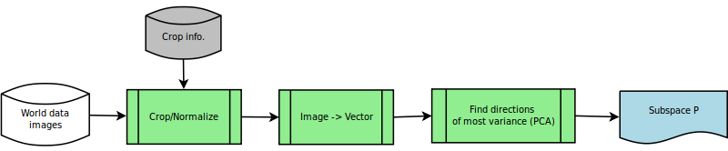
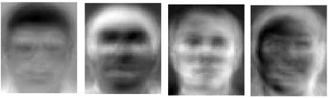
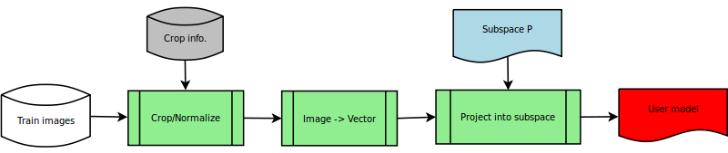
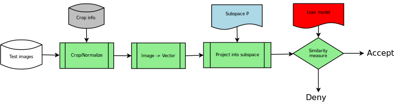

==============================================
Practical torch5spro: Face verification system
==============================================

Imagine the following setup: you want to create a face verification system.
You have 3 images of yourself (frontal faces) that you want to use as template (reference).
The goal is that only you (your face) can unlock the system and that everyone else are impostors.

+---------------------------------------+----------------------------------------+----------------------------------------+
|.. image:: 1001_f_g1_s01_1001_en_1.jpg | .. image:: 1001_f_g1_s01_1001_en_2.jpg | .. image:: 1001_f_g1_s01_1001_en_3.jpg |
|   :height: 144                        |    :height: 144                        |    :height: 144                        |
|   :width: 180                         |    :width: 180                         |    :width: 180                         |
|   :alt: Reference 1                   |    :alt: Reference 2                   |    :alt: Reference 3                   |
+---------------------------------------+----------------------------------------+----------------------------------------+

(We will refer to these 3 images as training images.)

The problem of using the 3 images directly for template matching (when you match a new image pixel-by-pixel to an old) 
is that the "space" is too large.
Even if the images are relatively small, say 80 by 64 pixels, the possible variations are very large (64*80*256*3. using height * width * pixel value * 3 colors).
To compare two vectors (images) in this 64*80*256*3 dimensional space is not optimal and will yield bad results.
We would therefore like to understand/learn a subspace in which comparison is better suited.
This approach to the problem was one of the first successful techniques in face recognition an is referred to as Principal Component Analysis (PCA).
PCA is a technique that finds the optimal subspace (principal directions) to represent our images.
Because the image-form of these principal components look like "faces" and that PCA is a form of eigenvalue decomposition, this techniques is often referred to as Eigenface composition.

In this practical tutorial we will demonstrate one possible way to implement a eigenface face verifier in torch5spro.

In summary we will perform the following steps to train our system

* Derive a subspace which represent a "face"
* Using the above subspace, create a model of the user
* Compare an unknown image to the model of the user

+---------------------------------------------------------------------------------------------------+
| Nomenclature                                                                                      |
+========================+==========================================================================+
| World data / images    | Used to train a subspace in which it is easier to represent a face       |
+------------------------+--------------------------------------------------------------------------+
| Training data / images | Used to create user model                                                |
+------------------------+--------------------------------------------------------------------------+
| Test data / images     | Used to evaluate the system. Includes both the target user and impostors |
+------------------------+--------------------------------------------------------------------------+

Deriving a better representation (finding principal components)
---------------------------------------------------------------

Imagine that you toke all the photos of all your friends.
You crop those images so only the face is visible and you align their eye-centers.
If you take the average of all this images, you will get an average "face" of all your friends.

If you now consider the difference between each individual face (friend) compared to this average face,
you can understand that the difference is not completely arbitrary.
There is some sort of manifold/subspace/representation in which "all" faces lie.
It is this space we are searching for.

When implementing our system in torch5spro we approach the problem very much the same.
We start by collecting as many photos as we can from any different individuals.
This collection is referred to as the world set.
We crop, normalize and align all those faces.
Thereafter we compute the average face.
The task of cropping a set of images using a database we have covered in this practical example
:ref:`practical-cropping-images`.

  
(Please note that the difference between an image and an vector is just the representation.
An image is a 2D array while an vector is a 1D array. 
If we pick out the values row-by-row from the image (2D array) we can easily create a 1D array (size: rows * cols).)

.. code-block:: python

  """
  Crop and normalize all the images needed
  """

  import Cropper

  # crop all the images in our database
  myCropper = Cropper.Cropper('my-world-database.xml')
  world_images = myCropper.get_all()

+------------------------------------------+-------------------------------------------+-------------------------------------------+
|.. image:: 1001_f_g1_s01_1001_en_1.cn.jpg | .. image:: 1001_f_g1_s01_1001_en_2.cn.jpg | .. image:: 1001_f_g1_s01_1001_en_3.cn.jpg |
|   :height: 144                           |    :height: 144                           |    :height: 144                           |
|   :width: 180                            |    :width: 180                            |    :width: 180                            |
|   :alt: Reference 1                      |    :alt: Reference 2                      |    :alt: Reference 3                      |
+------------------------------------------+-------------------------------------------+-------------------------------------------+

After cropping and normalizing all the images it is time to derive the subspace.

.. code-block:: python
  
  """
  To derive the subspace using Single Value Composition
  """

  # turn all images into vectors (from 2D arrays -> 1D arrays)
  # the function vectorOf is a help function to exactly this
  world_vectors = map(torch.core.array.uint8_2.vectorOf, world_images)

  # Vertically stack all the vectors in to an 2D array
  A = torch.core.array.float64_2(len(world_vectors), world_vectors[0].extent(0))
  # TODO, STACK THE ARRAYS

  # Find the principal components 
  U = torch.core.array.float64_2()
  S = torch.core.array.float64_2()
  V = torch.core.array.float64_2()

  torch.math.svd(A, U, S, V)

Below is 4 example images of principal eigenfaces.
Each eigenface is orthogonal to all the rest and they each spann one direction in our eigenface space.

Create a model of the user
--------------------------

Now when we have derived a more a subspace, 
in which it is better to work with out face images,
it is time to create a user model.
The purpose of the user model is to have something to compare against.

Test system with unknown image
------------------------------

